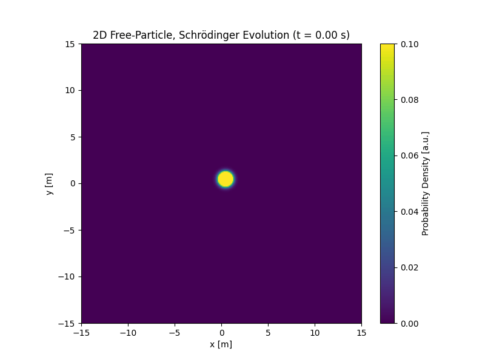
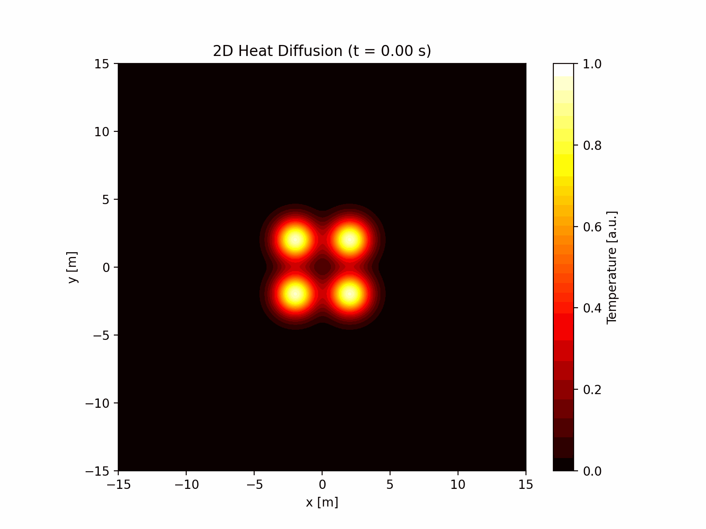

# Numerical Methods Project - Part 2

This repository contains simulations of various physical systems using numerical methods.

## Simulations

### 1. Disease Spread Simulation


This simulation models the spread of a disease through a population of agents in a 2D space. Key features include:
- Agent-based movement with linear trajectories and wall collisions
- Infection spread through proximity and contact
- Vaccination station where agents can get vaccinated
- Temporary immunity after recovery
- Real-time visualisation of:
  - Agent states (susceptible, infected, immune, vaccinated)
  - Infection and vaccination percentages over time

Parameters can be adjusted to study:
- Disease transmissibility
- Recovery time
- Vaccination effectiveness
- Population density
- Agent movement patterns

### 2. Schrödinger Evolution


This simulation demonstrates the time evolution of a quantum wave packet in two dimensions. Features include:
- Free-particle Schrödinger equation solution using spectral methods
- Initial Gaussian wave packet with momentum
- Probability density visualisation
- Time evolution of the quantum state

The simulation helps visualise:
- Wave packet spreading
- Quantum interference
- Conservation of probability
- Phase evolution

### 3. Heat Diffusion


This simulation shows the diffusion of heat in a 2D medium. Features include:
- Four initial temperature hotspots
- Heat equation solution using spectral methods
- Temperature distribution visualisation
- Time evolution of the temperature field

The simulation demonstrates:
- Heat conduction
- Temperature equilibration
- Diffusion patterns
- Conservation of energy

### 4. Poisson Equation


This simulation demonstrates the solution of the Poisson equation with moving source terms. Features include:
- Dynamic source terms that move in a periodic pattern
- Solution using spectral methods
- Potential field visualisation
- Time evolution of the electrostatic potential

The simulation helps visualise:
- Electrostatic potential distribution
- Source-sink dynamics
- Field propagation
- Boundary effects

## Running the Simulations

Each simulation can be run using its respective Python script:

```bash
# Infection spread simulation
python Infection_Spread.py

# Schrödinger evolution
python Schrodinger_Evolution.py

# Heat diffusion
python Heat_Diffusion.py

# Poisson equation
python poissonSimulation.py
```

## Dependencies

The simulations require the following Python packages:
- NumPy
- Matplotlib
- SciPy

## Implementation Details

### Disease Spread
- Uses agent-based modeling
- Implements spectral diffusion for infection spread
- Includes vaccination and immunity mechanics
- Real-time visualisation with matplotlib

### Schrödinger Evolution
- Solves the free-particle Schrödinger equation
- Uses Fast Fourier Transform for spectral methods
- Implements periodic boundary conditions
- Visualises probability density

### Heat Diffusion
- Solves the heat equation
- Uses spectral methods for efficient computation
- Implements periodic boundary conditions
- Visualises temperature distribution

### Poisson Equation
- Solves the Poisson equation with moving sources
- Uses Fast Fourier Transform for spectral methods
- Implements periodic boundary conditions
- Visualises electrostatic potential distribution

## Customisation

Each simulation can be customised by adjusting parameters such as:
- Grid resolution
- Domain size
- Time step
- Physical constants
- Initial conditions

See the individual script files for detailed parameter descriptions and default values.
