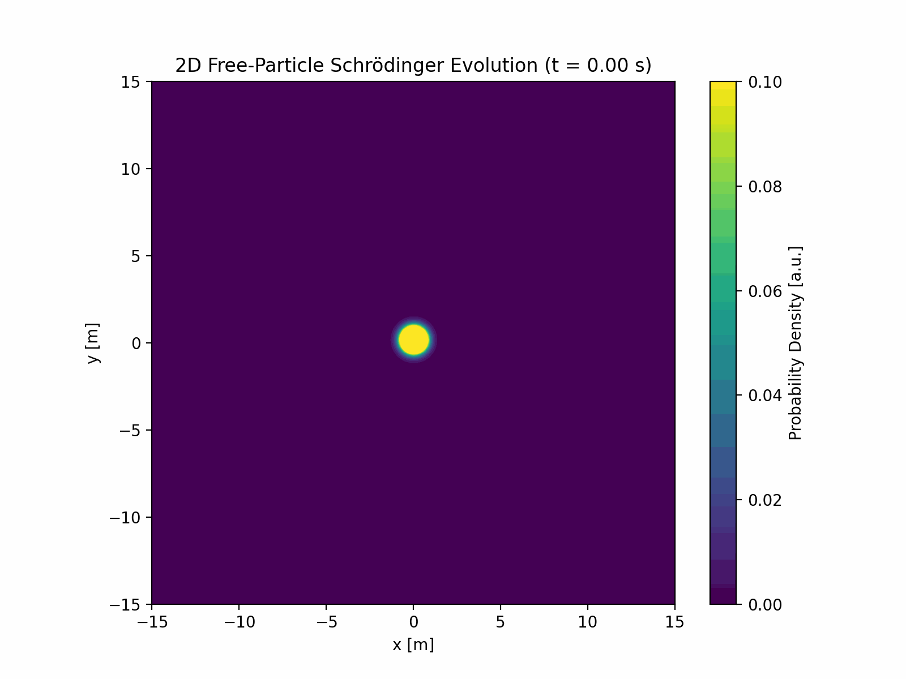
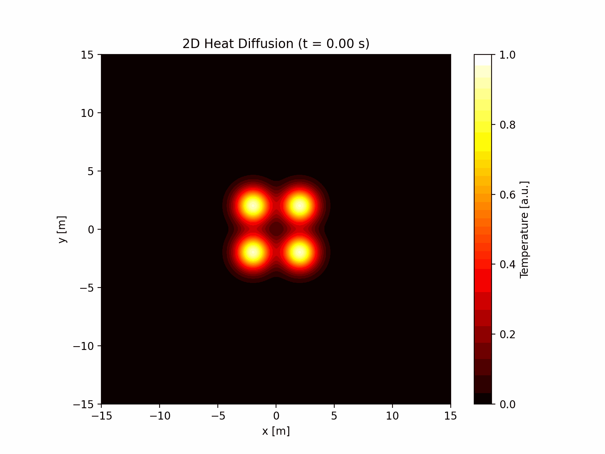

# Numerical Methods Project - Part 2

This repository contains simulations of various physical systems using numerical methods.

## Disease Spread Simulation


This simulation demonstrates the spread of disease through a population with the following features:
- Agent-based movement with realistic collision detection
- Infection spread through proximity and contact
- Recovery and temporary immunity
- Vaccination station with probability-based vaccination
- Real-time visualisation of infection and vaccination percentages

The simulation shows how diseases can spread through a population and how vaccination can help control the outbreak.

## Simulations

### 1. Schrödinger Evolution


This simulation demonstrates the time evolution of a quantum wave packet in two dimensions. Features include:
- Free-particle Schrödinger equation solution using spectral methods
- Initial Gaussian wave packet with momentum
- Probability density visualisation
- Time evolution of the quantum state

The simulation helps visualise:
- Wave packet spreading
- Quantum interference
- Conservation of probability
- Phase evolution

### 2. Heat Diffusion


This simulation shows the diffusion of heat in a 2D medium. Features include:
- Four initial temperature hotspots
- Heat equation solution using spectral methods
- Temperature distribution visualisation
- Time evolution of the temperature field

The simulation demonstrates:
- Heat conduction
- Temperature equilibration
- Diffusion patterns
- Conservation of energy

## Running the Simulations

Each simulation can be run using its respective Python script:

```bash
# Infection spread simulation
python Infection_Spread.py

# Schrödinger evolution
python Schrodinger_Evolution.py

# Heat diffusion
python Heat_Diffusion.py
```

## Dependencies

The simulations require the following Python packages:
- NumPy
- Matplotlib
- SciPy

## Implementation Details

### Disease Spread
- Uses agent-based modeling
- Implements spectral diffusion for infection spread
- Includes vaccination and immunity mechanics
- Real-time visualisation with matplotlib

### Schrödinger Evolution
- Solves the free-particle Schrödinger equation
- Uses Fast Fourier Transform for spectral methods
- Implements periodic boundary conditions
- Visualises probability density

### Heat Diffusion
- Solves the heat equation
- Uses spectral methods for efficient computation
- Implements periodic boundary conditions
- Visualises temperature distribution

## Customisation

Each simulation can be customised by adjusting parameters such as:
- Grid resolution
- Domain size
- Time step
- Physical constants
- Initial conditions

See the individual script files for detailed parameter descriptions and default values.
